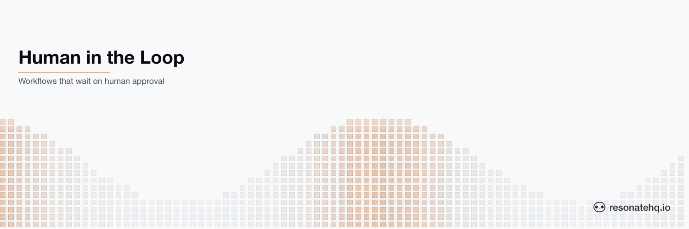

<picture>
  <source media="(prefers-color-scheme: dark)" srcset="./assets/banner-dark.png">
  <source media="(prefers-color-scheme: light)" srcset="./assets/banner-light.png">
  
</picture>

# Human-in-the-loop

**Resonate Rust SDK**

This example showcases Resonate's ability to block a function execution's progress while waiting for an action or input from a human.

Instructions on [How to run this example](#how-to-run-the-example) are below. The full pattern is documented at [docs.resonatehq.io/get-started/examples/human-in-the-loop](https://docs.resonatehq.io/get-started/examples/human-in-the-loop).

## Indefinite function suspension

The Human-in-the-Loop example showcases how Resonate enables a function to suspend execution for an indefinite amount of time. That is, when the function awaits a latent durable promise, it pauses execution and resumes only when the promise resolves.

```rust
#[resonate::function]
async fn foo(ctx: &Context, workflow_id: String) -> Result<String> {
    // Latent durable promise — no function backing it. Resolved externally.
    let blocking_promise = ctx.promise::<bool>();
    let promise_id = blocking_promise.id().await?;

    // Hand the promise ID to the outside world (email, webhook, log, ...).
    ctx.run(send_email, promise_id.clone()).await?;

    // Suspend until the promise resolves. Survives crashes.
    let _approved = blocking_promise.await?;

    Ok(format!("workflow {workflow_id} completed"))
}
```

This enables a wide range of use cases where a function may depend on a human interaction or human input for it to continue.

Use cases like this have traditionally been quite complex to solve, requiring the steps to be broken up and triggered by schedules or a queuing architecture.

Resonate pushes that complexity into the platform, enabling a much simpler developer experience for these use cases.

## Deduplication

With Resonate, each function invocation pairs with a promise. Each promise has a unique ID in the system.

The Resonate system deduplicates based on the promise ID and will either reconnect to a PENDING execution, or return the result of the RESOLVED promise.

This example showcases how this works in the gateway:

```rust
async fn start_workflow(
    State(state): State<AppState>,
    Json(req): Json<StartReq>,
) -> impl IntoResponse {
    // Same workflow_id reconnects to a PENDING execution rather than starting a new one.
    let result: String = state
        .resonate
        .rpc(&req.workflow_id, "foo", req.workflow_id.clone())
        .target("poll://any@workers")
        .await
        .expect("rpc to worker failed");

    Json(json!({ "message": result }))
}
```

## Load balancing and recovery

This example is capable of showcasing Resonate's automatic load balancing and recovery.

Run multiple workers and start multiple workflows. You will eventually see each worker pick up a workflow.

Try killing one of the workers while the workflow is blocked and watch it recover on another worker. The latent promise lives on the server, so the resumed workflow waits on the same promise the killed worker was suspended on.

## How to run the example

This example uses [Cargo](https://www.rust-lang.org/tools/install) as the build tool. After cloning, change directory into the project root.

This example application requires that a Resonate Server is running locally.

```shell
brew install resonatehq/tap/resonate
resonate dev
```

You will need 3 terminals to run this example, one for the HTTP Gateway, one for the Worker, and one to send a cURL request. This does not include the terminal where you might have started the Resonate Server.

In _Terminal 1_, start the HTTP Gateway:

```shell
cargo run --bin gateway
```

In _Terminal 2_, start the Worker:

```shell
cargo run --bin worker
```

In _Terminal 3_, send the cURL request to start the workflow:

```shell
curl -X POST http://localhost:5001/start-workflow \
  -H "Content-Type: application/json" \
  -d '{"workflow_id": "hitl-001"}'
```

The worker will print a `CLICK TO RESOLVE` link that you can open in your browser. Hitting that URL sends another request to the gateway, which resolves the blocking promise and allows the workflow to complete.

## Learn more

- [Resonate Documentation](https://docs.resonatehq.io)
- [Human-in-the-Loop Pattern](https://docs.resonatehq.io/get-started/examples/human-in-the-loop)
- [Rust SDK Guide](https://docs.resonatehq.io/develop/rust)
